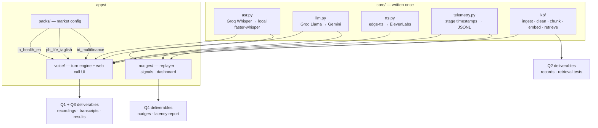

# Architecture

## Overview

Four deliverables, one system. The knowledge base (Q2) is the foundation; the
English voice agent (Q1) and the Philippines/Indonesia agents (Q3) are the same
turn engine loading different market configuration; the live-nudge pipeline (Q4)
reuses the same speech and telemetry layers against streamed audio.



Two decisions shape everything else:

**Telemetry is a core primitive.** Every stage of every request is timestamped
into JSONL: `audio_received → asr_done → retrieval_done → llm_done → tts_done →
delivered`. The same module produces the voice agent's response-time figures and
the live pipeline's P50/P95 per-component report. Latency is never something we
bolt on at the end.

**The voice app is a configuration interpreter, not three bots.** A market pack
is a YAML file holding language policy, prompt, qualification rules, TTS voice,
knowledge-base namespace and fallback phrasing. Localization therefore lives in
data that can be diffed and shown side by side, rather than in three forked
copies of a prompt.

---

## Q2 — Knowledge base

### Sources

Real public health-insurance content (product pages, FAQ sections, policy
wording PDFs with tables) supplies genuine mess: navigation chrome, repeated
footers, inconsistent terminology, PDF tables that extract badly. Alongside it
sit a small number of authored "internal" documents — an agent sales script, an
objection-handling sheet, a qualification rules table, and a sample lead list
carrying synthetic PII — so the cleaning stage has duplicates, contradictions
and personal data to actually demonstrate on.

Records cite their real source URL for traceability. The agent itself speaks for
a fictional brand and never claims to be a real insurer.

### Pipeline

```
fetch → extract → clean → deduplicate → detect PII → chunk → embed → index
```

| Stage | Approach | Failure handling |
|---|---|---|
| fetch | `httpx`, polite delay, cached to `data/raw/` | non-200 and timeouts recorded in an ingestion report, never silently dropped |
| extract | `trafilatura` for HTML main content, `pdfplumber` for PDFs including tables | pages yielding under 200 characters are flagged `extraction_suspect` for review |
| clean | strip nav/header/footer/cookie banners, collapse whitespace, normalize headings, dates to ISO, currency to a canonical form, unify terminology via a synonym map | source contradictions flagged rather than auto-resolved |
| deduplicate | SHA-256 for exact duplicates, MinHash/Jaccard at 0.85 for near-duplicates | the longer record is kept, the shorter recorded as `duplicate_of` |
| PII | regex detectors for phone, email, Aadhaar-style IDs, policy numbers, plus name heuristics | records are masked in place and marked `pii=true`; unmasked text never enters the index |
| chunk | structure-aware — split on headings, target ~350 tokens with 60-token overlap, never split a table row from its header | oversized atomic blocks kept whole and marked |
| embed | local `bge-small-en-v1.5` (English), `bge-m3` (multilingual for Q3) | runs locally, so indexing never depends on a rate-limited API |
| index | SQLite for records and metadata, FAISS for vectors | index rebuilt deterministically from SQLite by `make kb` |

### Record schema

| Field | Purpose |
|---|---|
| `record_id` | stable identifier, e.g. `kb_policy_014` |
| `title` | human-readable heading |
| `content` | cleaned, chunked text |
| `category` | taxonomy leaf (see below) |
| `source_url` / `source_type` | provenance — page, PDF, internal document |
| `section_path` | heading trail within the source, e.g. `Plans > Family Floater > Waiting Periods` |
| `version` / `effective_date` | versioning and recency |
| `checksum` | content hash; a changed hash mints a new version |
| `superseded_by` | set when a newer version replaces this record |
| `pii` / `pii_types` | whether personal data was found and what kind |
| `lang` | `en`, `fil`, `id` |
| `ingested_at` | audit trail |

### Taxonomy

`product` · `policy_rule` · `qualification` · `faq` · `objection` · `process`

The six categories map directly onto the six question types the retrieval tests
must demonstrate, and let the agent bias retrieval by conversation stage — an
objection turn searches `objection` and `policy_rule` first.

### Retrieval and ranking

Hybrid search: BM25 over the record text and dense vector search over the
embeddings, fused with Reciprocal Rank Fusion, then reranked by a local
cross-encoder when more than a handful of candidates survive. Category filtering
applies when the conversation stage implies one.

The threshold matters more than the ranking. If the top fused score falls below
`RETRIEVAL_MIN_SCORE`, the retriever returns nothing rather than its best guess,
and the agent is required to say it does not have the information. This is the
mechanism behind the "state when information is unavailable" requirement — it is
enforced by retrieval, not by asking the model nicely.

### Citation

Every retrieval returns `record_id`, `title` and `source_url`. The agent's
answer carries the record IDs it used; the transcript logs them per turn. Any
answer in any recorded call can therefore be traced to a specific record and its
source.

---

## Q1 — Voice agent

### Call flow

Browser captures a turn of speech and posts it. The server transcribes,
advances the dialogue state, retrieves if needed, generates a grounded reply,
synthesises audio, and returns audio plus transcript. Half-duplex by design: one
speaker at a time, no barge-in. This keeps the system debuggable and every
component individually testable.

```
greet → consent → qualify → answer / handle objection → business action → close
                     ↑______________|
                  (unfilled or conflicting slots)
```

### Qualification logic

Slots: age, city, family size, existing conditions, budget. The state machine
tracks which are filled and which are contradictory — a caller who says "I'm 30"
and later "I was born in 1975" trips a conflict rule, and the agent asks a
clarifying question instead of silently picking one. Preliminary eligibility is
computed from the qualification records in the knowledge base, not from
constants in the prompt.

### Grounding rules

The system prompt carries conversation policy and tone. It does not carry FAQs,
objections or product policy — those are retrieved per turn through a
`search_kb` tool call. When retrieval returns nothing above threshold the agent
uses the pack's fallback phrasing and offers escalation. When the caller asks for
a human, an escalation record is written and the call is closed politely.

### Business action

On a qualified call the agent creates a lead record and schedules a callback,
written to a mock CRM file with the qualification summary, the record IDs cited
during the call, and the escalation status.

---

## Q3 — Philippines and Indonesia

Same engine, different packs.

**Philippines — life insurance / bancassurance.** English, Filipino and natural
Taglish. Real usage puts English finance nouns inside Tagalog grammar, so the
pack's prompt specifies register and particle use rather than a target language,
and the fallback phrasing is written in Taglish rather than translated into it.

**Indonesia — multifinance.** Formal and colloquial Bahasa Indonesia with the
finance vocabulary customers actually use — `cicilan`, `tenor`, `denda`, `DP`,
`jatuh tempo`, `angsuran`, `pembiayaan` — plus at least one non-Jakarta regional
accent in the ASR test set.

Each pack ships a localization table showing the literal translation next to the
localized line and the reason for the difference, which is the evidence the
assessment asks for. ASR is evaluated per market and reported with provider,
model, languages tested, code-switching behaviour, observed errors and
regional-accent performance. Fallback and escalation phrasing stay in the
customer's language and register.

---

## Q4 — Live insights and nudges

Audio is streamed — either live or a recording replayed at real-time speed in
chunks, which the assessment permits. Nothing waits for the call to end.

```
chunk (2s) → ASR → rolling transcript → signal extraction → nudge control → WebSocket → dashboard
```

**Signals.** A fast rule/keyword pass runs on every chunk; an LLM pass runs on a
rolling window when the cheap pass fires or the topic shifts. Tracked: intent and
topic shift, compliance gaps, sentiment and frustration, buying signals, missed
opportunities, callback needs. The two-tier design keeps per-chunk latency low
and LLM calls infrequent enough for a free tier.

**Nudge control.** Confidence threshold, duplicate suppression by signal
fingerprint, per-topic cooldown, priority ordering, and expiry so a stale nudge
disappears rather than lingering. This is what separates useful prompts from
alert spam, and is graded directly.

**Latency.** Every stage timestamped; the report gives P50/P95 end-to-end plus
per-component breakdown for ASR, signal extraction, LLM and delivery.

**Quality.** A deliberately noisy, ambiguous call is included in the test set to
measure how often the pipeline fires when it should stay quiet, reported as an
approximate false-positive rate.

---

## Error handling

Failure is expected at every boundary, and each has a defined behaviour rather
than a stack trace:

- **ASR provider down or rate-limited** → automatic fallback to local
  faster-whisper; the call continues with a logged provider switch.
- **LLM rate-limited** → fallback provider; if both fail, the agent says it is
  having trouble and offers a callback rather than going silent.
- **Retrieval below threshold** → explicit "I don't have that information",
  never an invented answer.
- **TTS failure** → the reply is returned as text to the interface so the call
  degrades instead of dying.
- **Ingestion failure** → recorded in the ingestion report with the reason; the
  build continues over the remaining sources.

## Testing

Unit tests cover the deterministic pieces where correctness is checkable:
cleaning, near-duplicate detection, PII masking, chunk boundaries, RRF fusion,
slot conflict detection, and every nudge-control rule (cooldown, dedupe,
expiry). These need no API access and run offline.

Retrieval quality is measured by a fixed query set with expected record IDs,
scored and written into the Q2 retrieval report with an honest verdict per query.

The voice agents are exercised through scripted scenario calls — cooperative,
objection, conflicting details, out-of-scope, escalation — recorded and
transcribed into the deliverables folders.
